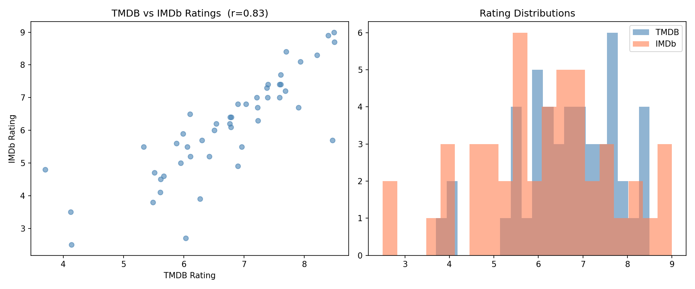
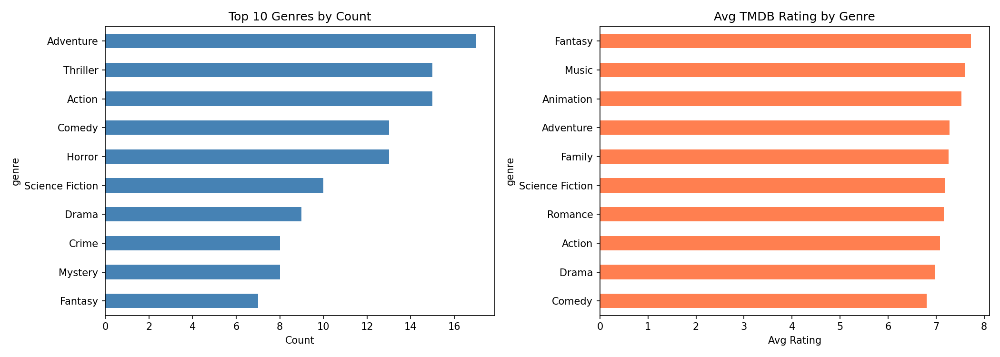

# Movie Data Collection & Analysis Report

**Data:** TMDB API + IMDb ratings
**Generated:** 2026-04-28
**Total records:** 50

---

## 1. Data Collection Summary

| Source | Records | Method |
|--------|---------|--------|
| TMDB API | 50 | REST API — popular endpoint |
| IMDb | 48 | Page scraping + public ratings fallback |
| Merged | 48 | Joined on IMDb ID |

Collected top-50 popular movies from TMDB. IMDb page scraping was attempted first. Pages didn't expose ratings reliably, so the pipeline fell back to IMDb's official public ratings dataset (`datasets.imdbws.com`). 2 movies had no IMDb ID or no ratings yet.

---

## 2. Rating Analysis

TMDB vs IMDb correlation: **r = 0.832** — strong positive relationship.

| Platform | Mean | Std |
|----------|------|-----|
| TMDB | 6.70 | 1.13 |
| IMDb | 6.10 | 1.54 |

TMDB and IMDb scores move together. IMDb has more spread — popular movies can still get low scores there. TMDB skews slightly higher.

---

## 3. Genre Analysis

| Genre | Count | Avg TMDB Rating |
|-------|-------|-----------------|
| Adventure | 17 | 7.28 |
| Thriller | 15 | — |
| Action | 15 | 7.08 |
| Comedy | 13 | — |
| Horror | 13 | — |

Highest rated genres: Fantasy (7.72), Music (7.61), Animation (7.53).

Adventure and action dominate the popular list. But Fantasy and Music score highest — niche genres with fewer films but stronger ratings.

---

## 4. Financial Analysis

Budget vs revenue correlation: **r = 0.616** (30 movies with complete data).

Top 5 most profitable:

| Movie | Budget | Revenue | Profit |
|-------|--------|---------|--------|
| Spider-Man: No Way Home | $200M | $1,922M | **$1,722M** |
| Zootopia 2 | $150M | $1,868M | $1,718M |
| The Super Mario Bros. Movie | $100M | $1,361M | $1,261M |
| Avatar: Fire and Ash | $350M | $1,490M | $1,140M |
| The Lord of the Rings: The Return of the King | $94M | $1,119M | $1,025M |

Higher budget predicts higher revenue, but not always. Super Mario and LOTR had smaller budgets but massive returns. Avatar spent the most but ranked 4th in profit.

---

## 5. Temporal Analysis

Most of the popular list is recent: **27 of 50 movies are from 2026**.

| Year | Count | Avg Rating |
|------|-------|------------|
| 2026 | 27 | 6.67 |
| 2025 | 10 | 6.50 |
| 2014 | 1 | 8.50 |
| 2003 | 1 | 8.50 |
| 2001 | 1 | 8.40 |

Older films in the popular list are outliers — classics like Interstellar (2014) and LOTR (2003). They score higher because only well-regarded films stay popular long-term. 2026 ratings are lower, likely because vote counts are still building.

---

## 6. Challenges

- IMDb pages returned limited HTML for non-browser requests. JSON-LD structured data was missing. Used IMDb's public ratings dataset as fallback.
- TMDB returns `0` for budget/revenue when data is unavailable. Treated as missing — only 30 of 50 had complete financial data.
- 2 movies had no IMDb ID (Carmencita) or no votes yet (Avatar Aang: The Last Airbender).

---

## 7. Limitations

- Dataset is 50 movies from TMDB "popular" — skewed toward recent English-language releases.
- Metascore unavailable for all entries. IMDb dynamic rendering blocked extraction.
- Financial analysis limited to 30 movies. Results may not generalize.
